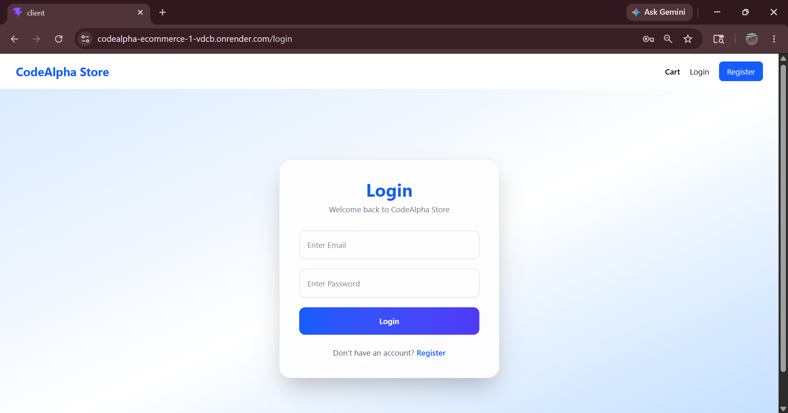
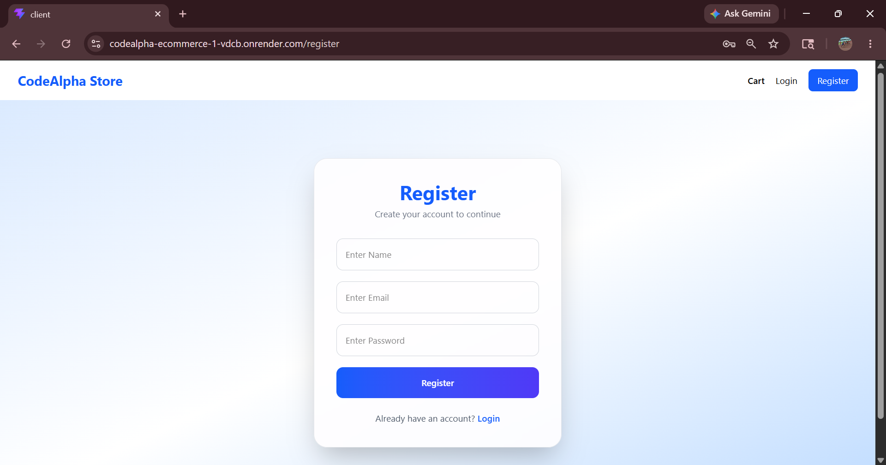
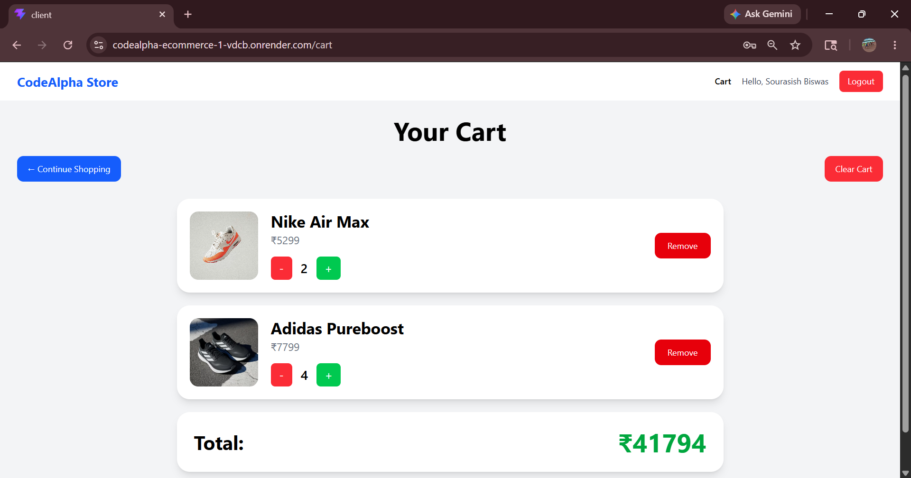
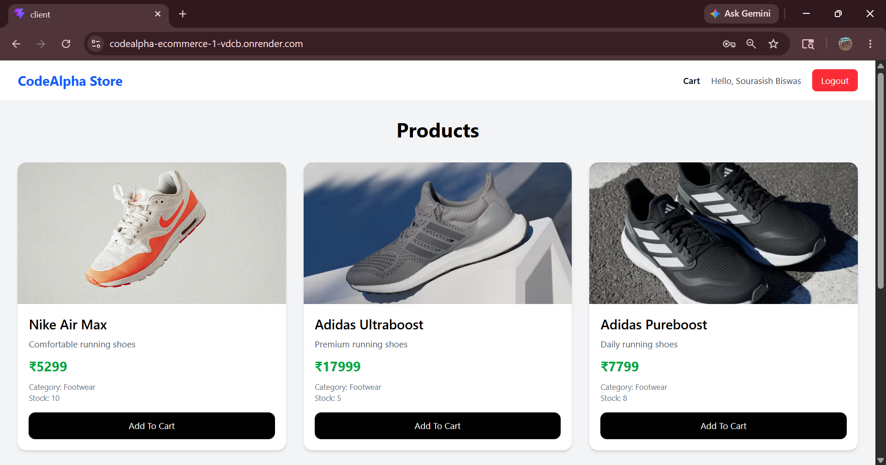

# 🛒 CodeAlpha Store

A full-stack ecommerce web application built using the MERN stack. Users can register, login, browse products, add items to cart, manage quantity and remove products from the cart.

## 🚀 Features

- User Authentication (Register/Login)
- JWT Authentication
- Product Listing
- Add to Cart
- Remove from Cart
- Quantity Management
- Dynamic Cart Total
- Toast Notifications
- Responsive UI
- MongoDB Database Integration

## 🛠️ Tech Stack

### Frontend

- React.js
- Vite
- Tailwind CSS
- React Router DOM
- Axios
- React Hot Toast

### Backend

- Node.js
- Express.js
- MongoDB
- Mongoose
- JWT Authentication
- bcrypt.js

## 📂 Project Structure

```bash
Fullstack/
│── client/          # Frontend (React + Tailwind)
│── server/          # Backend (Node + Express)
│── README.md
```

## ⚙️ Installation

### 1. Clone Repository

```bash
git clone https://github.com/SBR2006V/CodeAlpha_Ecommerce.git
```

### 2. Install Dependencies

#### Frontend

```bash
cd client
npm install
```

#### Backend

```bash
cd ../server
npm install
```

### 3. Environment Variables

Create a `.env` file inside the `server` folder:

```env
MONGO_URI=your_mongodb_connection_string   #Create an account in MongoDB (can make a free one) and get your connection string
JWT_SECRET=your_secret_key  #Type your secret key there
PORT=5000
```

### 4. Run Backend

```bash
cd server
npm run dev
```

### 5. Run Frontend

```bash
cd client
npm run dev
```

Frontend runs on:

```text
http://localhost:5173
```

Backend runs on:

```text
http://localhost:5000
```

## Live Demo

Frontend:
https://your-frontend-url.onrender.com

Backend:
https://your-backend-url.onrender.com

## 📸 Screenshots

### Login Page



### Register Page



### Cart Page



### Products Page



## 🌐 Future Improvements

- Product Search
- Checkout System
- Payment Gateway
- Admin Dashboard
- Wishlist
- Order History

## 👨‍💻 Author

**Sourasish Biswas**

GitHub: https://github.com/SBR2006V
